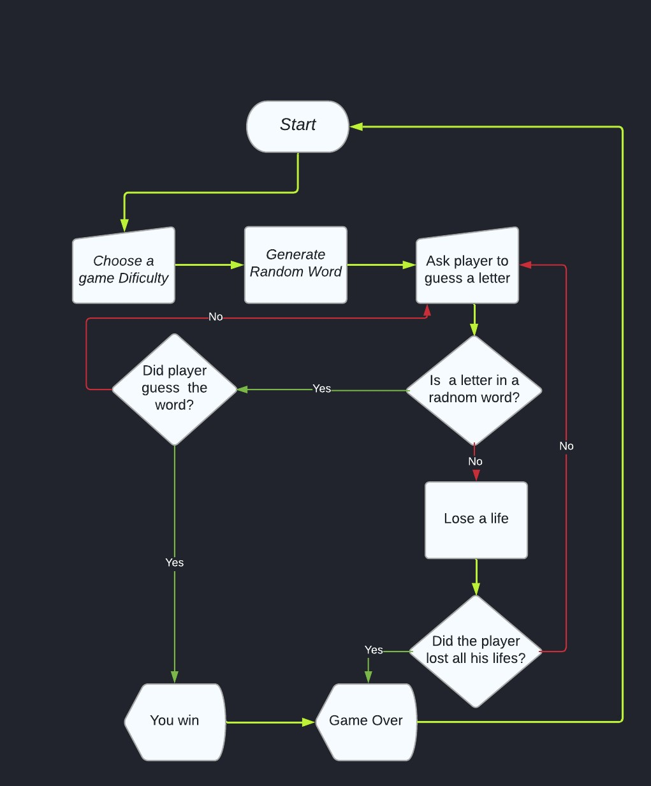

# Hangman

Hangman is a Python terminal game, which runs in the Code Institute mock terminal Heroku. 

Users can try to beat the computer by guessing the letters of the missing word. Every wrong guess takes one life. The game is over if the user guesses all the missing letters of the hidden word or if he loses all his lives.

# How to play

It's a popular word guessing game where the player attempts to build a missing word by guessing one letter at a time. 

The player must guess the letters of the hidden word, if the guess is correct, the letter missing in the word is replaced by the correct letter.

If the player puts an incorrect letter the error message is displayes and the player is asked to resubmit their choce. Each wrong guess takes 1 life. 

Game ends if the player correctly guess all the letters of the missing word or if the player loses all his lives.

# User Stories 

- As a user I want to easily understand the purpose of the game
- As a user I want to have fun
- As a user I want to see my remaining lives
- As a user I want the game to be challenging 

# Desing

## Flowchart:

