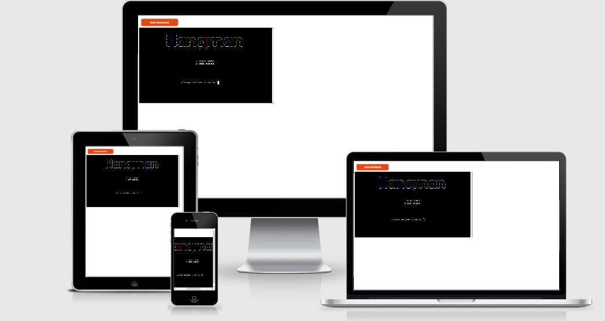
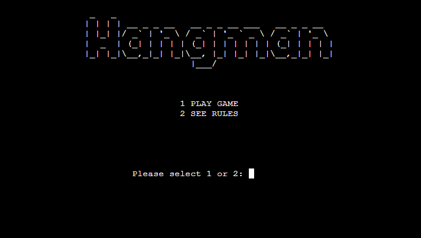
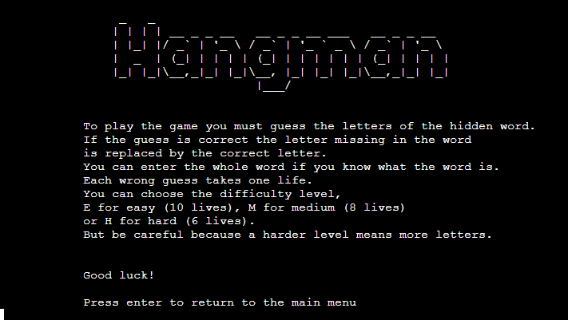
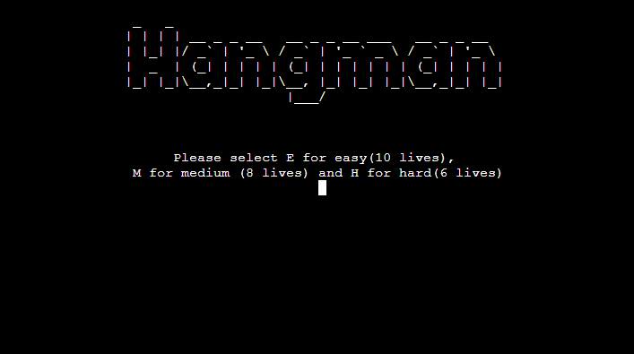
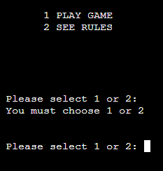
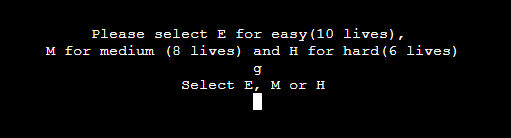
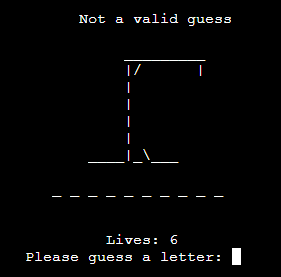
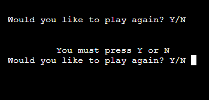

# Hangman

Hangman is a Python terminal game, which runs in the Code Institute mock terminal Heroku. 

Users can try to beat the computer by guessing the letters of the missing word. Every wrong guess takes one life. The game is over if the user guesses all the missing letters of the hidden word or if he loses all his lives.

# How to play

It's a popular word guessing game where the player attempts to build a missing word by guessing one letter at a time. 

The player must guess the letters of the hidden word, if the guess is correct, the letter missing in the word is replaced by the correct letter.

If the player puts an incorrect letter the error message is displayes and the player is asked to resubmit their choce. Each wrong guess takes 1 life. 

Game ends if the player correctly guess all the letters of the missing word or if the player loses all his lives.

# User Stories 

- As a user I want to easily understand the purpose of the game
- As a user I want to have fun
- As a user I want to see my remaining lives
- As a user I want the game to be challenging 

# Design

## Flowchart:

## Wireframes

## Home Page

## Rules

## Select difficulty level

## Game

# Features

- Welcome Screen - User can choose between starting the game or see the rules

- Game rules - the user can see the game rules by selecting number two from the main menu

- Difficulty Level - by selecting number one from the main menu user can also select the diffculty level and start the game 

- Game - the game will start by slectig the game difficulty. Random word will be selected from a list of selected words

- User Input - the player is asked to guess a letter. If the entry is correct, the letter will appear in the word, if the entry is incorrect, the user will lose one life and the hangman will start drawing.

- Invalid inputs - to be sure that the user provide the correct input, for any invalid input the error massage will appear. 

* Please select 1 or 2
* Select E, M or H
* Not a valid guess
* You must press Y or N

# Issues and Bugs
# Technologies Used
# Testing
# Deployment 
# Credits

